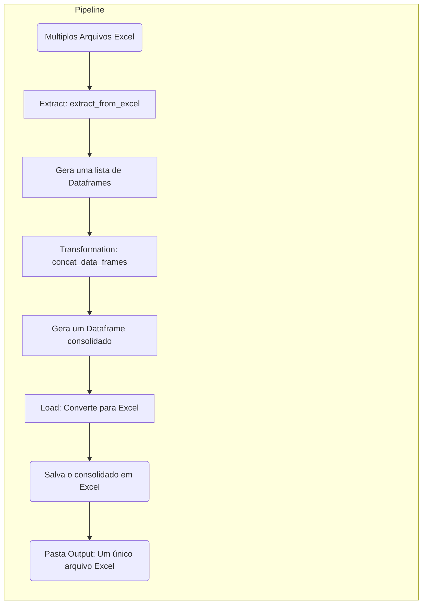

# **Contexto**

---

Este projeto se trata de um processo de ***ETL (Extract, Transform e Load)*** para a área de Recursos Humanos (RH) da  **Calin Carteira Digital** . O objetivo principal é gerenciar e analisar os dados relacionados ao absenteísmo dos colaboradores. O processo de extração, transformação e carga dos dados é fundamental para garantir a integridade e a qualidade das informações utilizadas nas análises e tomadas de decisão. Ao implementar esse fluxo de ETL, busca-se otimizar a gestão de recursos humanos, identificar padrões de ausência, entender causas subjacentes e desenvolver estratégias eficazes para melhorar a produtividade e o bem-estar no ambiente de trabalho.

## Workflow

